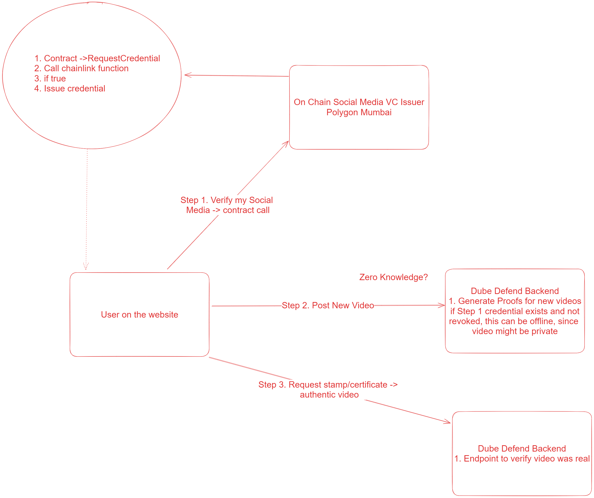

## Introduction

    

A project to create an automatic polygon issuer using chainlink functions and account abstraction. This allows 
creators to protect their content without having to go through a complicated process each time they publish new content.

This was done for the constellation chainlink hackathon

## Installation

Backend
1. goto backend folder and run ./dl_circuits.sh
2. run npm start

### Changelog
- [x] Created a basic UI to get youtube metadata
- [x] Add a sample template from polygon id (this was renamed to backend - curl https://iden3-circuits-bucket.s3.eu-west-1.amazonaws.com/latest.zip --output latest.zip)
- [ ] Deploy on server
- [ ] Tweak polygon sample project to emit VC's
- [ ] Tweak sample to emit VC's using AA
- [ ] Allow authorization via the UI
- [ ] Expose a simple explorer and view my own profile page
- [ ] Allow for revoking a VC
- [ ] Create a scehma a video credential

### Issues to resolve
Not able to add credentialAtomicQueryMTPV2OnChain from polygon sample due to large file size need to check

### Schema's used 
1. Prove ownership of account, existing schema - https://schema-builder.polygonid.me/schemas/5f67feb5-5210-4e6d-9f49-ded962501b1b
2. Need to create credential for a particular media, so that it can be chained

### Steps
1. User requests for a verifiable claim
2. Backend Issuer Node verifies the claim and issues the 