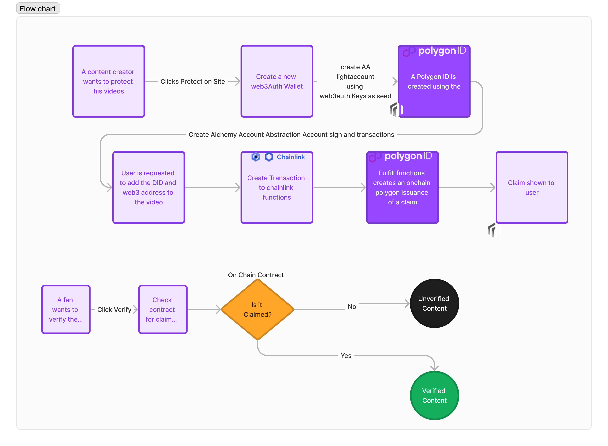

## Introduction

    

A project to create an automatic polygon issuer using chainlink functions and account abstraction. This allows 
creators to protect their content without having to go through a complicated process each time they publish new content.

This was done for the constellation chainlink hackathon

## Installation
1. Use yarn and install inside each of the sub packages
2. use forge for the contracts folder

### Changelog
- [x] Created a basic UI to get youtube metadata
- [x] Add a sample template from polygon id (this was renamed to backend - curl https://iden3-circuits-bucket.s3.eu-west-1.amazonaws.com/latest.zip --output latest.zip)
- [x] Tweak polygon sample project to emit VC's
- [x] Working end to end flow with functions and Polygon ID
- [ ] Tweak sample to emit VC's using AA

### Issues to resolve
AA issue with Biconomy need to resolve

### Example Transaction with Claim for polygon that was fulfilled via a chainlink state change
https://mumbai.polygonscan.com/tx/0x7ed386efe1d6a3e27e1fdc7982b40d05018f13d7aa915fb3716f73aa5861c6b3#eventlog

### Steps
User calls below contract via frontend (we hardcode youtube api key for testing)
1. SocialMediaVerifier.sol -> SendRequest -> SendRequest to chainlink to call youtube api.

We write in Source.js to get the data from youtube description eg. useraddress for a Video

2. chainlink -> SocialMediaVerifier.sol -> fullfillrequest
// Create a mapping between request id and user address
// check if the response has address and it matches the user address

3. fullfillrequest -> issueCredential in IssuerSimple.sol (polygon Template for Verifiable credential)
// Issue a credential to the user